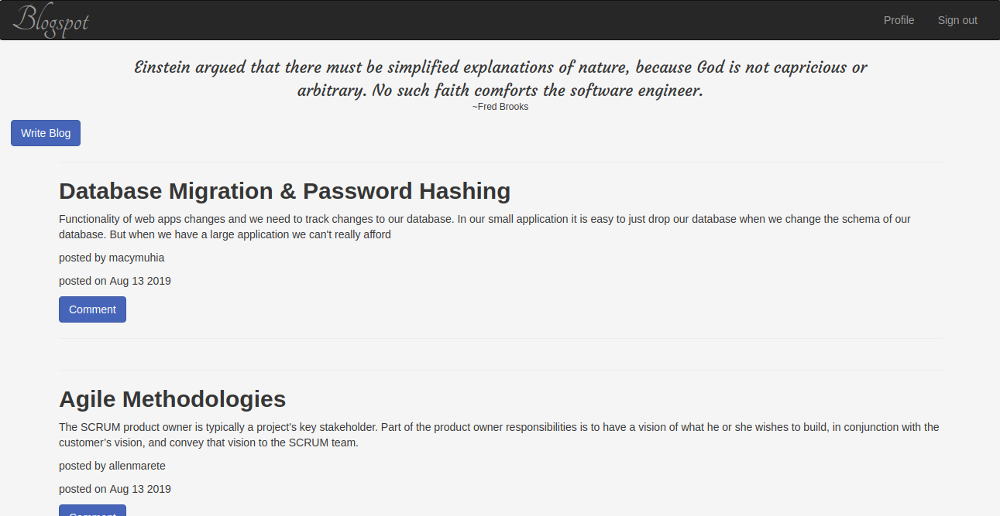

# BLOGSPOT
## Description
Blogspot is an application that allows users to read blogs and comment on the articles. User can sign up and sign in in order to write blog posts or comment on blog posts. A random quote is displayed on each page of the application for inspiration.
## Blogspot Screenshot


Last modified 13th August 2019.
#### By **Mercy Muhia**

## Project behaviour

A user can see all blogs
A user can sign up and sign in to comment on a blog post
A user should receive a welcome email on sign up

 
## Setup/Installation Requirements
```Git clone https://github.com/macymuhia/Blogspot.git```

```cd Blogspot```

```python3.6 -m venv --without-pip virtual```

```source virtual/bin/activate```

```curl https://bootstrap.pypa.io/get-pip.py | python```

```pip install -r requirements.txt```

```export SECRET_KEY=<SET_YOUR_SECRET_KEY>```

```export DATABASE_URL=<SET_YOUR_DATABASE_URL>```

```export MAIL_USERNAME=<SET_YOUR_MAIL_USERNAME>```
```export MAIL_PASSWORD=<SET_YOUR_MAIL_PASSWORD>```

```python3.6 manage.py db init```

```python3.6 manage.py db migrate -m "Initial Migration"```

```python3.6 manage.py db upgrade```

```python manage.py server```

## Technologies Used
Python3.6 (Flask), HTML & CSS (Bootstrap)
## Support and contact details
To contribute, submit a pull request. 
For questions or concerns, reach out on mercy8muhia@gmail.com
### License
*MIT*

### &copy; 2019 Mercy Muhia